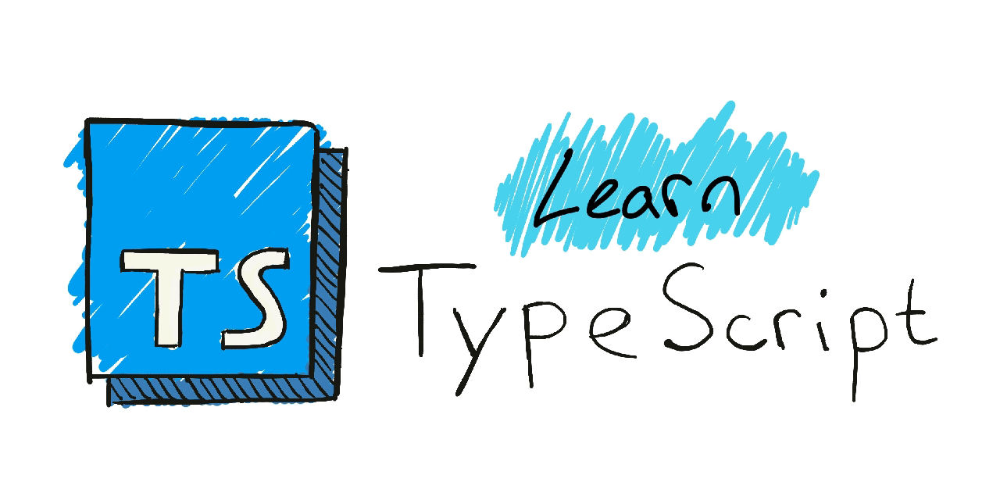

# TypeScript Coding Tasks

A collection of tasks to solve using TypeScript and TDD (Test Driven Development). Test cases are included for each task.

## Using the Repository

This repository has been designed for intermediate developers who would like to become more familiar with TypeScript. Simply fork/clone to your local machine then navigate to the folder of your chosen task. Run the tests `yarn test`. All tests will fail in their initial state. Your objective is to write code that makes all the tests pass. As we progress through the tasks, we will also look at writing our own tests using [Jest](https://jestjs.io/).

Happy hacking :)

## Getting Started

These instructions will get you a copy of the project up and running on your local machine.

### Prerequisites

To get up and running, you will need the following tools.

### Code

To write and test code you will need [NodeJS](https://nodejs.org/en/) and [Yarn](https://yarnpkg.com/lang/en/) installed. If your on a Mac, use [Homebrew](https://docs.brew.sh/Installation) for installation.

```
brew install node
brew install yarn
```

Will also need [TypeScript](https://www.typescriptlang.org/) installed.

```
npm install -g typescript
```

### Installing

Change to the root directory and install required packages.

```
yarn
```

## Running the tests

Tests can be run globally from the root directory by running `yarn test`.

```
yarn test
```

Alternatively for running running tests specific to a given task, the description inside the `describe` block can be used.

```
yarn test -t "<task-description>"
```

## Solutions

If you at any you point get stuck, step by step solutions for each task can be found in the [Wiki](https://github.com/MrKiplin/learn-typescript/wiki).

## Authors


- **Theodore Jones** - [MrKiplin](https://github.com/MrKiplin)
